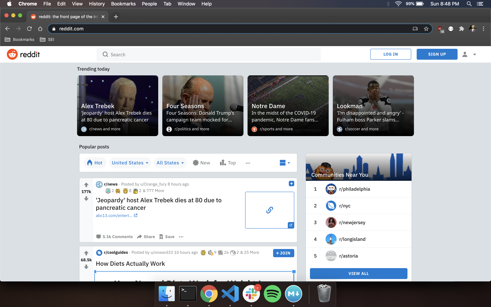
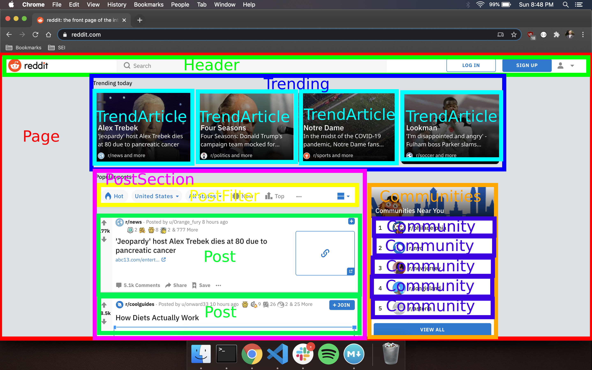

# REACT!

React is 'A JavaScript library for building user interfaces.' Its a way to make front-end webpages. React is a solution to the problem of how to build large webpages with data that changes over time. DOM manipulation on webpages can be costly and slow, as our browsers read the DOM tree to find and effect changes, and React can mitigate a lot of this.

## So what? How is this better than some HTML/JS/CSS files?

React allows us to write HTML and JS together to keep our ideas all together, and allows us to seperate our pages and even the particular parts of each page into encapsulated components. We can also to reuse these components for different data, keeping our code DRYer.

### The advantages of react

- React automatically updates components and views for us as data changes. No more query selectors to update components! (though occasionally they are useful for some stuff) React uses a virtual DOM and only makes changes where needed, making pages faster.
- React allows us to save data locally in the components that use them, or globally to share them among components that need them. 
- Reuse components anywhere you want them to go.  Write each once, and use them where they're needed.
- Developer tools that make it easy to diagnose and fix bugs. Read the value of variables in real time as you interact with the page.
- A slew of packages, tool, and tutorials. React is tremendously popular, and people love to improve it.
- React native - Write mobile apps with React.
- React live updates as we write it, so we can see our changes in real time.

## The history of React

- First used by Facebook in 2011.
- Adopted by Instagram in 2012.
- Made open source in May 2013.

React has continued to gain polularity and usage over time

#### Stack overflow questions regarding specific frameworks:

#### Job postings regarding specific frameworks:

#### Websites built with react

- Facebook
- Instagram
- Airbnb
- Atlassian
- CloudFlare
- BBC
- Dropbox
- Imgur
- Khan Academy
- Netflix
- OkCupid
- Postmates
- Reddit

## JSX

JSX is a syntax that allows us to inject HTML into our JavaScript. JSX is similar to XML. JSX is not necessary in creating react components, but is strongly encouraged, as it allows React to work to it's full power, and has bonuses like better error messages.

React compiles JSX, which creates HTML elements on the page and inserts it into our virtual DOM.

## Components

Components are individual pieces of our webpages.  They can be as small as a list item or as large as a whole page. Separating our website into components is where React shines.  Components encompass their own content, presentation, and behavior. Because we can store variables and functions inside each of our components and reuse them for different data, we can avoid creating variables like characterName15 or loginPageUsername.

Components can be classes or functions that return the views for each part of our pages. Classes are on their way out in React, and we will be using functional components in our lessons.

Choosing where and how to seperate our page into components will depend on how encapsulated, how reusable, and how customizable each part of our page needs to be.

##Let's get started!

The first thing we need is NodeJs, which allows us to run the JavaScript environment on our local machines.

[Install Node](https://nodejs.org/en/download/package-manager/)

We can install our react initializer using the following command, though there's no reason to 
(and will necessitate updates)

	npm install -g create-react-app
	
Instead, we can use the next command to create the React framework.  Navigate to where you want your new React project directory will be located, and run

	npx create-react-app [the name of our app]
	
Running `npx create-react-app hello_world` will create a project directory called hello_world.  There's a whole lot of new files here now. We won't need to deal with most of these.  We'll be working exclusively (for now at least) in the src folder.

Once the relevant packages are installed, cd into your project, open it in your code editor, and start the React app running using

	npm start
	
or

	npm run start

Our page will now run on `http://localhost:3000`, and will continually refresh as we edit the project. No more reloading!

Let's play with some components!

## Our components

Each component needs a few things: a return, at least one HTML tag within the return, and an export.  Lets write a basic component. I'll include the CSS in the file so we can get a better idea of what's going on, though in the future we will use a seperate CSS file.

Here's a simple header component:

	import React from 'react';

	export default function Header() {
	  return (
	    

	      <h1>Rick and Morty</h1>
	      
	    

	  );
	}

If we want to use this component on our main page, App.jsx (or App.js), we need to import it into our page, and call it in the appropriate place as we would other HTML components. 

	import './App.css';
	import Header from './Header';
	
	function App() {
	  return (
	    

	      <Header />
	      <h1>Welcome to my page!</h1>
	    

	  );
	}
	
	export default App;
	
Inserting our Header component into our code does the same as if we had written all of the HTML from the Header component in App.jsx, in a much more succinct way. Creating and rendering components in this way creats a tree of parent and child elements within our app, just like we have parent and child elements in our DOM.

## State

State in React is a repository for all of our stored data.  We use state over variables for React reasons.  React rerenders appropriate parts of the page when state changes. State also preserves data when pages rerender.  As of recently, React has shifted to a state management system called hooks.  
	
We need to make sure that we import the useState method at the beginning of our file.  It'll look like this:

	import React, {useState} from 'react'
	
Our hooke will be declared like so:

	const [name, setName] = useState('Jordan Walke')
	
This does three things. It creates a variable called `name` that is saved in state, it creates a method called `setName` that we can use to modify our name variable, and it sets the initial value of name to 'Jordan Walke'. Our state-changing functions can be called anything we want, but the well-established convention is to call it `set[variable name]`.  You should do that.

Each component in React has it's own state, which allows us to reuse the same component multiple times and not have the worry about giving each variable a different name, as each instance of the component has it's own version of state.

### Using State

In JSX syntax, when we want to inject JavaScript (including variables) into our HTML, we designate it using curly brackets.  If we want to use the name that we have stored in state in an h1 in our HTML, we would do so as follows:

	<h1>Hello, {name}!</h1>
	
On the screen, we'll see:

	Hello, Jordan Walke!

### Setting State

Changing the value of our variables, also called setting state, is done using the method that we created when we initialized the variable.  If I want to change the value of our name variable to 'Mike', I would do so like this:

	setName('Mike')
	
It's as easy as that! Once my name variable is updated in state, React will update the relevant HTML to reflect the change, so my h1 will now be rendered as 

	Hello, Mike!
	
on my page.

### Triggering state changes

We often want parts of our page to trigger as a result of user interaction.  Just like in vanilla JS, we can use event listeners to watch for user input. Event listeners look different in React, and can be attached directly to the HTML elements that they're meant to monitor. You may have seen something similar before, with a few syntax changes.

In a conventional webpage, we may have a button that triggers the function `doSomething`.  Our button could look like this in our HTML:

	<button class='do-something-button'>Click me!</button>
	
And we might have some code in our JS file that looks like this:

	let doSomethingButton = document.querySelector('.do-something-button')
	doSomethingButton.addEventListener("click", doSomething)
	
to trigger our `doSomething` function when the button is clicked.  

In React, we can accomplish the same with this line:

	<button onClick={doSomething}>Click me!</button>
	
`onClick` and `onChange` are our most commonly used event listeners (also called event handlers), but there are many others we can use.  Take a look at the following list:

[React Events](https://reactjs.org/docs/events.html)

### Conditional Rendering

If we dont use querySelector in React, how do we add or remove elements from our page in response to user input? We can use state to control whether or not elements appear. We can create boolean (or other) variables in our state, and then evaluate those booleans with conditional statements that will control whether or not we render an element.

JSX does not support if-else-then statements, so we need to use ternaries. We can use the truth value of variables to determine whether or not certain HTML variables are shown. If we are using a variable called `showDetails` to control whether additional details are being rendered to the page, we could do this:

	{showDetails ?
		
These are additional details

		:
		null
	}
	
When show Details is true, the first condition in the ternary is returned, and our 
 tag is rendered to the page.  When it is false, nothing is returned and so nothing shows on screen.

There's also a shorter version of conditional rendering we can use when we want to show or hide information called a guard operator.  It looks a little strange and relies on how JavaScript processes truth logic.

	{showDetails && 
These are additional details
}
	
This works the same as the ternary above.  When `showDetails` is false, JS does not read past the && operator, and does not render the 
 tag. When `showDetails` is true, JS reads past our &&, and returns the second clause of the statement.

## Passing Props

We know that state is stored within specific components, so how do we share this data between components? We pass the data through what are called props.

Data only flows one way in React, from parent to child component.  Props are passed within the component call.  If we want to pass data down from App into our Characters component, it would look like this in our App component:

	import './App.css';
	import Header from './Header';
	import React, { useState, useEffect } from 'react';
	import axios from 'axios';
	import Characters from './Characters'
	
	function App() {
	  let api = axios.create({ baseURL: 'https://rickandmortyapi.com/api/' });
	  const [counter, setCounter] = useState(0);
	  const [characterList, setCharacterList] = useState([]);
	
	
	  const getCharacters = async () => {
	    const response = await api.get('/character/?page=2');
	    setCharacterList(response.data.results);
	  };
	
	  return (
	    

	      <Header />
	      <h1>Hello, {name}</h1>
	      <button onClick={getCharacters}>Get Characters</button>
	      <Characters characterList={characterList}/>
	    

	  );
	}
	
	export default App;
	
On the line where we call the <Characters/> component, we pass down our `characterList` variable by adding `characterList={characterList}`.

To receive props, we must tell our Characters component to expect it by adding a parameter to the Characters function

	import React from 'react'

	export default function Characters({characterList}) {
	  return (
	    

	      <h1>Our Characters</h1>
	    

	  )
	}

## Component Lifecycle

There are often time when we want functions to run as soon as the page loads, or when something other than user input occurs.  We can think of the lifecycles of a react component as occuring in three stages:

- Mounting: When the component is first called on and rendered to the screen
- Updating: When the component undergoes changes in state or receives new props
- Unmounting: When the component is no longer being shown, when we close out of the component

With hooks, React has created a function that handles all of these events: useEffect.

A useEffect function is written as follows:

	useEffect(()=>{
		doSomething()
	}, [updateCondition])
	
useEffect takes 2 arguments: the function that runs when useEffect is triggered, and the dependecy array.  useEffect runs automatically when the component it is in is mounted, and also runs whenever there is a change to any of the props or state variables in the dependency array.